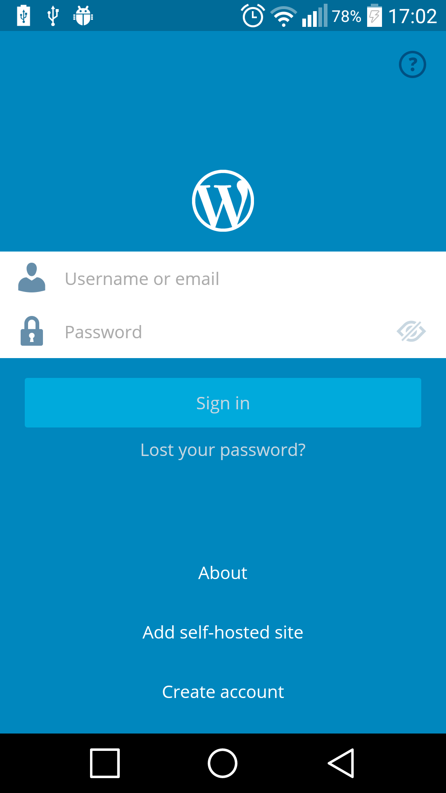
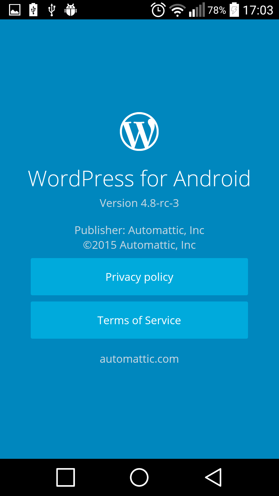

# Relatório 5 - ESOF #
## Evolução do Software ##
### Introdução

No âmbito da unidade curricular de ESOF foi-nos proposto identificar e evoluir uma feature para, no nosso caso, a aplicação mobile [WordPress-Android](https://github.com/wordpress-mobile/WordPress-Android), sem que as restantes funcionalidades fossem quebradas. O objetivo deste relatório é a explicitação da feature, dos componentes que a implementam e da evolução da mesma bem como o pull request e a sua aceitação (ou não).

É de salientar que na escolha do repositório, numa fase inicial da UC, o grupo não previa que nos iria ser pedido contribuir para o mesmo o que talvez nos fizesse escolher outro repositório. Assim sendo, é relevante mencionar que a aplicação WordPress para Android está tecnicamente finalizada e além disso o repositório contem bastantes ficheiros e *packages* sendo que este é bastante complexo o que torna o desenvolvimento da feature um desafio maior


### Feature 

Depois de analisadas várias sugestões pelos elementos do grupo e depois de falar com o professor, chegámos à decisão que a feature que iriamos implementar seria um simples botão "*About*". Pareceu-nos uma decisão obvia pois é comum noutras aplicações móveis do mesmo tipo a existência de um *about* na página inicial e a aplicação não o tem. 

Assim sendo, a feature a ser evoluida é a página inicial em que tecnicamente iremos implementar uma nova feature, um botão *about* na página inicial para o utilizador. Este só será visível na página inicial caso o utilizador não esteja logado ou não tenha conta, sendo que ao ser carregado é aberta uma nova página que contém links e informações sobre o WordPress e da empresa "mãe" [Automattic](https://automattic.com/).


### Identificação de componentes que implementam a feature

Ao evoluir o welcome screen tivemos que "mexer" em ficheiros importantes para a aplicação que requerem cuidado para não alterar nada que pudesse prejudicar a aplicação bem como em manter os [padrões de código utilizados](https://github.com/wordpress-mobile/WordPress-Android/blob/develop/CODESTYLE.md). O código implementado foi para a aplicação Android sendo que as linguagens utilizadas foram Java para Android e XML.

No welcome screen foi criado o botão "*About*" que pertence à classe ```WPTextView``` e implementámos um Listener para quando o utilizador carregasse no botão. Ao carregar, uma nova actividade é lançada ```AboutActivity.class``` que abre a página about para o utilizador. Sendo que foram usados os métodos e componentes já existentes do projeto por forma a tornar o projeto harmonioso na junção de ambas as partes.

```java
mAboutButton = (WPTextView) rootView.findViewById(R.id.about_button);
        mAboutButton.setOnClickListener(new OnClickListener() {
            @Override
            public void onClick(View v) {
                Activity activity = getActivity();
                if (activity != null) {
                    ActivityLauncher.aboutPage(activity);
                }
            }
        });
```

É de salientar que o botão em termos visuais foi feito no ficheiro do fragmento de signin em xml e formatado de forma a ser visualmente apelativo e bem como a se enquadrar com a página.

```xml
<org.wordpress.android.widgets.WPTextView
                android:id="@+id/nux_create_account_button"
                style="@style/WordPress.NUXFlatButton"
                android:layout_width="wrap_content"
                android:layout_height="@dimen/nux_main_button_height"
                android:layout_gravity="center"
                android:layout_marginLeft="16dp"
                android:layout_marginRight="16dp"
                android:gravity="center"
                android:text="@string/nux_welcome_create_account" />
```

### Evolução da feature

Com a implementação do botão *about*, estamos a acrescentar funcionalidades ainda que informativas à aplicação. Na nossa opinião, é uma componente importante geralmente implementada em variadíssimas outras situações.
Na imagem seguinte é possível ver o resultado final da implementação do botão *about* na página inicial da aplicação.

<p align="center" ></p>

Quando se clica no botão, é redirecionado para a seguinte página:

<p align="center" > </p>

Desta forma, acreditamos que melhorámos a página inicial da aplicação, facultando de uma forma simples uma opção onde será possível ao utilizador conhecer os termos de utilização, a política de privacidade e a instituição que desenvolveu a aplicação.

### Análise Crítica

Concluída a implementação desta feature, podemos analisar mais uma vez que a forma como o código se encontra estruturado e documentado é fácil de compreender, o que facilitou o seu desenvolvimento. 

Foi submetido um [*pull-request*](https://github.com/wordpress-mobile/WordPress-Android/pull/3503) que passou com sucesso na compilação do servidor de integração contínua [Travis](https://travis-ci.org/wordpress-mobile/WordPress-Android/builds/96073274), concluíndo então que o estilo de escrita de código usado por nós se encontra de acordo com as *guidelines* que a equipa do WordPress predefiniu.


### Autores

* Fábio Amarante
* Luís Gonçalves
* Ricardo Lopes


## Contribuição

Relativamente à contribuição de cada elemento para a realização deste relatório, o grupo considera que o trabalho foi igualmente dividido pelos três elementos.
